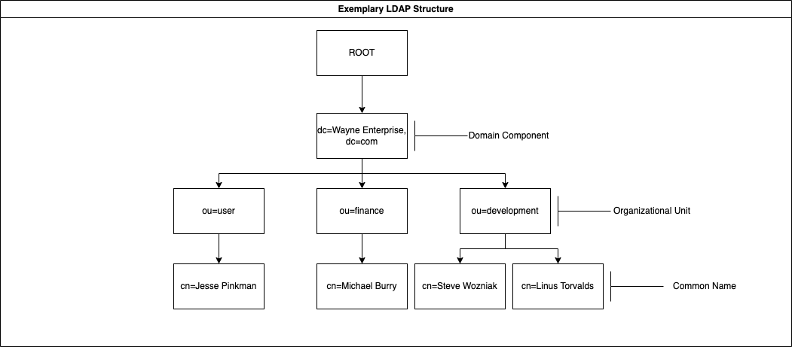
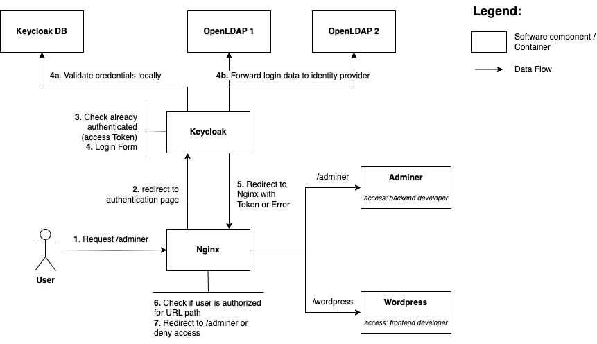

# Enterprise Identity and Access Management Demo
This is a proof of concept to demonstrate how an enterprise identity and access management could be setup. Project by Marvin Welzbacher &amp; Dominic Viola (DHBW CAS)

## Concepts
The following concepts must be addressed to understand the whole Enterprise IAM architecture.

### 1. LDAP (Lightweight Directory Access Protocol)
- Opensource protocol based on TCP/IP
- LDAP protocol can be used to access Directory Service Databases such as Active Directory or OpenLDAP

**LDAP terminology:**

| **Term** | **Meaning**        |
|----------|--------------------|
| o        | organization name  |
| ou       | organization unit  |
| cn       | common name        |
| sn       | sur name           |
| dn       | distinguished name |
| dc       | domain component   |

**LDAP structure a.k.a. Data Information Tree (DIT):**



---
## Architecture



---

## 0 Prerequisits
1. Docker
1. Docker Compose

## 1 Setup
For Production use cases change the environment variables for the usernames and passwords.
Best practice is to use the --env-file keyword when building the containers with docker compose and putting the .env file that contains the values into the .gitignore.

## 2 Build & Run
Run the following commands to build and run all the containers in the architecture

```bash
docker-compose build
docker-compose up
```

---
## Development
Keycloak namespaces its components in Realms. These realms have to be persistet somehow, since containers are ephemeral. 
However it is possible to export Realms manually and the keycloak container will mount the exports in the "keycloak-main/data/realms" automatically on startup.

Export the current state of a realm with this command executed on the machine that runs Docker. This will create/override a file named ```<realm name>-realm.json``` in the local "keycloak-main/data/realms" folder:

```bash
docker exec keycloak /opt/keycloak/bin/kc.sh export --dir /opt/keycloak/data/import --realm <your realm name> --users skip
```